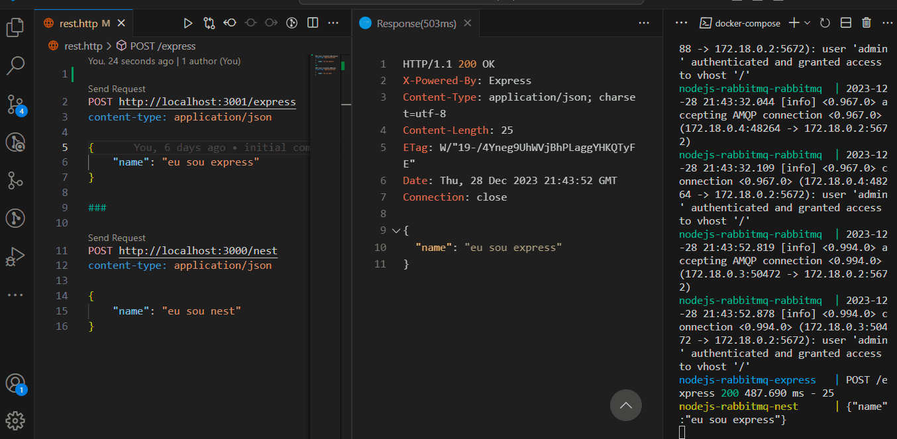

<h1 align="center">
     🐙 <a href="#" alt=""> Node.js Test Microservices</a>
</h1>

<h3 align="center">
    🧪 Backend Test. 💚
</h3>

<h4 align="center">
	🚧   Finished 🚀 🚧
</h4>

### Prerequisites

Before you need install follow tools in your machine:
[Git](https://git-scm.com), [Node.js](https://nodejs.org/en/), [Docker](https://www.docker.com/resources/what-container).
Beyond is good to has an editor for to work with the code like [VSCode](https://code.visualstudio.com/)

# Summary

- [1. Overview](#1-overview)
  - [1.1 Stack](#11-stack)
  - [1.2. Auxiliary libs](#12-auxiliary-libs)
- [2. How To Run](#2-🔬-how-to-run)
  - [2.1 Containers](#21-containers)
  - [2.2 Evaluating express and nest routes](#22-evaluating)
  - [2.4 API Endpoints](#24-endpoints)
- [3. How to create a new branch](#3-new-branch)
  - [3.1 Commits](#31-commits)


# 1. Overview

Example of RabbitMQ integration with Node.js applications nest and express using Docker.

Result:



## 1.1. Stack

- [Typescript](https://www.typescriptlang.org/.docs/handbook/typescript-in-5-minutes.html)
- [Node](https://nodejs.org/en/about/)
- [Docker](https://www.docker.com/resources/what-container)
- [Express](https://expressjs.com/)
- [Nest](https://nestjs.com/)
- [GitHub](https://github.com/)

## 1.2. Auxiliary libs

- [amqplib](https://www.npmjs.com/package/amqplib)

# 2. 🔬 How To Run

```bash

# Clone this repository
$ git clone https://github.com/LucasJunio/microservice-rabbitmq-express-nest.git

# Acces the project folder in your terminal/cmd
$ cd microservice-rabbitmq-express-nest

# Create queue and bind between exchanges on rabbitMQ http://localhost:15672
$ create queue nest and bind with exchange rota
$ create queue express and bind with exchange rota2


```

## 2.1. Containers

```bash

# Build the image and container docker
$ docker-compose up

# The aplication going to open in  port:3001 - access http://localhost:3001 and port:3000 - access http://localhost:3000

```

### 2.3 Evaluating express and nest routes

- With VSCode's Rest Client extension, open the **rest.http** file and make requests from the Express or Nest application and check the return in the opposite application's console.
- Send POST requests to **http://localhost:3001/express** or **http://localhost:3000/nest** sending JSON in the request body and check the return in the opposite application's console.

### 2.4 API Endpoints

- `POST http://localhost:3001/express`: test express.
- `POST http://localhost:3000/nest`: test nest.

# 3. How to create a new branch

Ever that's necessary to create a new branch feature, create by [main]branch, implement your development, merge this feature/branch to develop, when all it's ok, give a merge of this feature/branch to main[branch].

Let's go to follow the git flow patterns to create a new branch, to more info browse in link below to learn more how to implement in simple way.

Workflow gitflow: https://www.atlassian.com/br/git/tutorials/comparing-workflows/gitflow-workflow

```bash

# Example creating a new branch
$ git checkout -b feature/TASK-1

```

## 3.1. Commits

For commit your changes, you can follow the suggestion to use conventional commits [https://www.conventionalcommits.org/en/v1.0.0/] for to improve your commit descriptions and help the understand of the team. Exist a extension in vscode that can help you with this mission.

vscode extension id in .vscode/extensions.json:

"recommendations": ["vivaxy.vscode-conventional-commits"]

## 🦸 Author

<a href="https://madaztec.com/">
 
 <br />
 <sub><b>Lucas Junio</b></sub></a> <a href="https://madaztec.com/" title="Madaztec">🚀</a>
 <br />

---

## 📝 Licence

Made with ❤️ by Lucas Junio 👋🏽 [Contact](https://www.linkedin.com/in/lucas-junio/)
